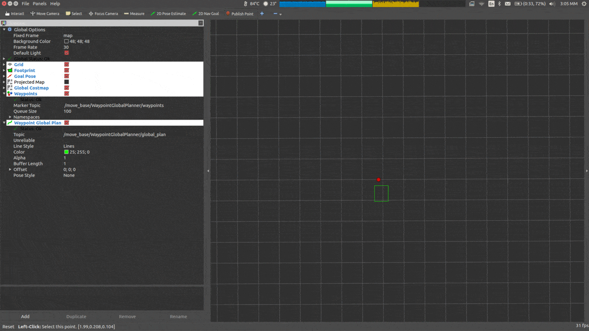

# waypoint-global-planner
A global planner that generates a path using manually inserted waypoints without taking into consideration obstacles in the global costmap.

### Usage
- See configuration example in config to be loaded in the namespace of move_base
- For easier usage deselect single click from rviz (Panels > Tool Properties > Publish Point > Single Click)
- From the toolbar select the Publish Point tool
- Start inserting waypoints
- To generate the path insert the final waypoint close to the latest one with a distance not exceeding the threshold ε (default 0.1m)
- The final goal pose is determined from the orientation of the line connecting the two final waypoints

